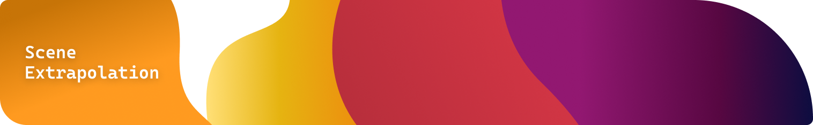

# Scene Extrapolation (Circadian Rhythm)

[](https://github.com/hacs/integration)
[](https://github.com/etokheim/scene_extrapolation/releases)
[](https://buymeacoffee.com/etokheim)

Create circadian lighting from the scenes you already have. The integration builds a Home Assistant scene that blends your day and evening looks from the sun’s cycle — cool by day, warm toward dusk — so activating it lights the room the way you want for *now*.

Pair it with an automation that re-activates the scene every few minutes (match the transition time) for a smooth all-day fade.

**Support the project:** [buymeacoffee.com/etokheim](https://buymeacoffee.com/etokheim)

## Install

1. Install via [HACS](https://hacs.xyz/) (search **Scene Extrapolation**), or copy `custom_components/scene_extrapolation` into your config.
2. Restart Home Assistant.
3. Add the integration once: **Settings → Devices & services → Add integration → Scene Extrapolation**.
4. Open **Scene Extrapolation** from the sidebar to create and edit rooms.

You do **not** add a new integration entry for each room — one instance covers every extrapolation scene.

## Setup

Create two (or more) **native** Home Assistant scenes for an area: how the room should look by day, and how it should look in the evening. You can also pin looks to dawn, sunrise, noon, sunset, and dusk.

Then, in the Scene Extrapolation sidebar, add an extrapolation scene for that area and assign those native scenes to the solar events you care about.

You might already have fixed scenes like this:


Scene Extrapolation blends between them so the room looks right whenever you activate it:


A typical result:


## Why use this?

1. **Simple** — it is still “just a scene”: activate it when you want that look; turn lights off normally when you don’t.
2. **Any colors** — not limited to white / warm white.
3. **Effects** — e.g. fireplace after sunset, or Christmas lights that still follow the day.
4. **Turn lights off or on** by time of day (bright undimmable lamp off in the evening; cozy lamp on only then).
5. **Not only lights** — a scene can drive shades, locks, and other entities if you want.
6. **Nightlights mode** — optionally use a dedicated scene when an `input_boolean` is on.

## Limitations

1. Works with scenes created in Home Assistant (not vendor scenes such as Hue-only scenes).
2. You need at least two native scenes per area you want to control — and HA’s scene editor is still tedious.
3. Activation is slower than a plain scene (~1 s vs ~200 ms in practice). Debug logging shows timing for your setup.

<details>
<summary>Example performance numbers</summary>

```
Loaded 5 scenes from in-memory entities
Time getting native scenes:               2.6ms
Time calculating solar events:            0.3ms
Time getting sun events (precalculated):  0.6ms
Time extrapolating:                     862.5ms
Time total applying scene:              866.3ms
```

</details>

### Alternatives

| Integration | Notes |
| --- | --- |
| [Flux](https://www.home-assistant.io/integrations/flux/) | Built-in; drives individual lights; YAML; smaller install base. |
| [Circadian Lighting](https://github.com/claytonjn/hass-circadian_lighting) | Drives lights/groups directly; richer options; large community. |

Scene Extrapolation stays scene-based on purpose: predictable, easy to combine with motion and schedules, and no “force lights on” loop you have to fight.

## Extend it

Keep the core simple, then add behavior with the rest of Home Assistant:

1. **Slow all-day change** — automation that activates the scene every ~5 minutes with a matching transition. A blueprint is available for this.
2. **Motion lighting** — automation that activates the scene on motion. A blueprint is available for this too.

## Support

If Scene Extrapolation saves you setup time or makes your evenings nicer, you can [buy me a coffee](https://buymeacoffee.com/etokheim):

[](https://buymeacoffee.com/etokheim)

Issues and ideas: [GitHub Issues](https://github.com/etokheim/scene_extrapolation/issues).

## Q&A

<details>
<summary><strong>What happens when the sun doesn't rise or set? (Polar regions, midnight sun, polar night)</strong></summary>

In polar regions the sun may never set (midnight sun) or never rise (polar night). When solar calculations fail completely, the integration uses **seasonal fallback times**:

- **Winter:** Dawn 8:45, Sunrise 10:30, Noon 12:00, Sunset 13:00, Dusk 22:00
- **Summer:** Dawn 2:15, Sunrise 4:00, Noon 13:00, Sunset 22:00, Dusk 23:55

When only some events fail, it keeps chronological order by taking the later of:

- previous event + 30 minutes, or
- that event’s seasonal fallback

**Example:** Dawn calculates as 06:00 but sunrise fails → use the later of 06:30 and the summer sunrise fallback (04:00) → **06:30**, so sunrise stays after dawn.

</details>
